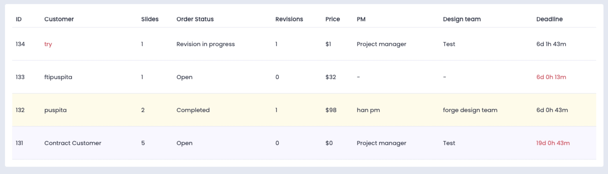

## Instructions

Welcome to the Code Exam! 👾

In the following 2 hours you'll be evaluated for your coding skills in solving a three-step challenge coming up with solution of different cases. After completing a task, take the time to refactor your code so it will be clean & organized before moving on.

### Getting Started

You are able to create a local project to upload it to the repository or use JavaScript / React online sandbox. It's up to you.

We are interest of your own resolving for the next cases:

1. Create custom hook of countdown timer. An abstract type of the hook is:

```ts
type Time = number;

type UseTimer = (initialTimeSeconds: Time) => Time;
```

2. Count `value` amount of the next interface:

```js
const children = {
  value: 1,
  children: [
    {
      value: 0,
      children: [{ value: 1 }, { value: 2, children: [{ value: 3 }] }],
    },
    { value: 4 },
  ],
};
```

Expected result is:

```js
const children = { ... };

function yourImplementation(...) { ... };

yourImplementation(children);
```

3. Create a markup for the next interface:

```js
[
  {
    id: 1,
    user: {
      name: "Implement Customer",
      hasCredits: false,
      suspended: true,
    },
    slides: 11,
    status: "Open",
    revisions: 0,
    price: "$0",
    manager: "Project manager",
    team: "-",
    deadline: "2021-09-11T00:00:00.000000Z",
    subscribed: true,
  },
  {
    id: 2,
    user: {
      name: "Implement Customer",
      hasCredits: true,
      suspended: false,
    },
    slides: 22,
    status: "New",
    revisions: 0,
    price: "$222",
    manager: "Project manager",
    team: "Alpaca",
    deadline: "2021-09-05T00:00:00.000000Z",
    subscribed: false,
  },
  {
    id: 3,
    user: {
      name: "Implement Customer",
      hasCredits: false,
      suspended: true,
    },
    slides: 33,
    status: "First draft in progress",
    revisions: 0,
    price: "$1000",
    manager: "Project manager",
    team: "Smash",
    deadline: "2021-08-30T00:00:00.000000Z",
    subscribed: false,
  },
  {
    id: 4,
    user: {
      name: "Implement Customer",
      hasCredits: false,
      suspended: false,
    },
    slides: 111,
    status: "Approved",
    revisions: 0,
    price: "$800",
    manager: "Project manager",
    team: "Alpaca",
    deadline: "2021-09-22T00:00:00.000000Z",
    subscribed: true,
  },
  {
    id: 5,
    user: {
      name: "Implement Customer",
      hasCredits: true,
      suspended: false,
    },
    slides: 222,
    status: "First draft in progress",
    revisions: 0,
    price: "$400",
    manager: "Project manager",
    team: "Alpaca",
    deadline: "2021-08-22T00:00:00.000000Z",
    subscribed: false,
  },
];
```

- If user is suspended ("Customer" column) add highlight color to the markup;
- If user has credits add highlight background color to a row;
- If order is subscribed add another highlight background color to row;
- If deadline is expired ("Deadline" column) add a highlight color;
- Styles are optional.

Example:  


### Notice

- If at any point something is unclear you may contact your interviewer;
- Let us know if the tasks implementation took more time than 2 hours;
- Follow best practices as much as possible, focus on the code quality;
- Adding styles to the last task is optional, but it is a valuable bonus;
- Good luck! ✌️
